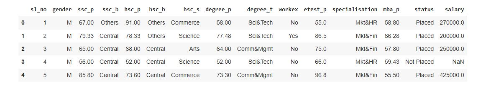

# Implementation-of-Logistic-Regression-Model-to-Predict-the-Placement-Status-of-Student

## AIM:
To write a program to implement the the Logistic Regression Model to Predict the Placement Status of Student.

## Equipments Required:
1. Hardware – PCs
2. Anaconda – Python 3.7 Installation / Moodle-Code Runner

## Algorithm
1. Import the standard libraries.
2. Upload the dataset and check for any null or duplicated values using .isnull() and .duplicated() function respectively.
3. Import LabelEncoder and encode the dataset.
4. Import LogisticRegression from sklearn and apply the model on the dataset.
5. Predict the values of array.
6. Calculate the accuracy, confusion and classification report by importing the required modules from sklearn.
7. Apply new unknown values 
## Program:
```python
/*
Program to implement the the Logistic Regression Model to Predict the Placement Status of Student.
Developed by   : Venkatesh E
RegisterNumber : 212221230119
*/
import pandas as pd

a=pd.read_csv("Placement_Data.csv")
a.head()

a1=a.copy()

a1=a1.drop(["sl_no","salary"],axis=1)
a1.head()

a.isnull().sum()

a1.head()

a.duplicated().sum()

from sklearn.preprocessing import LabelEncoder
b=LabelEncoder()

a1["gender"]=b.fit_transform(a1["gender"])
a1["ssc_b"]=b.fit_transform(a1["ssc_b"])
a1["hsc_b"]=b.fit_transform(a1["hsc_b"])
a1["hsc_s"]=b.fit_transform(a1["hsc_s"])
a1["degree_t"]=b.fit_transform(a1["degree_t"])
a1["workex"]=b.fit_transform(a1["workex"])
a1["specialisation"]=b.fit_transform(a1["specialisation"])
a1["status"]=b.fit_transform(a1["status"])

print (a1)

x=a1.iloc[:,:-1]
y=a1["status"]

from sklearn.model_selection import train_test_split
x_train,x_test,y_train,y_test=train_test_split(x,y,test_size=0.2,random_state=0)

from sklearn.linear_model import LogisticRegression
c=LogisticRegression(solver="liblinear")
c.fit(x_train,y_train)
y_pred=c.predict(x_test)
print(y_pred)

from sklearn.metrics import accuracy_score
acc=accuracy_score(y_test,y_pred)
acc

from sklearn.metrics import confusion_matrix
con=confusion_matrix(y_test,y_pred)
print(con)

from sklearn.metrics import classification_report
class_report=classification_report(y_test,y_pred)
print(class_report)

print(c.predict([[1,80,1,90,1,1,90,1,0,85,1,85]]))
```

## Output:
### Original data(first five columns):

## Data after dropping unwanted columns(first five):

### Checking the presence of null values:

## Checking the presence of duplicated values:

## Data after Encoding:

## Predicted Values:

## Accuracy Score:

## Confusion Matrix:

## Classification Report:

## Predicting output from Regression Model:


## Result:
Thus the program to implement the the Logistic Regression Model to Predict the Placement Status of Student is written and verified using python programming.
